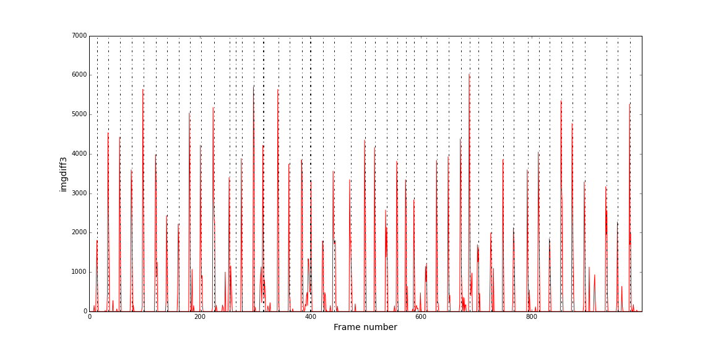

## Welcome to BeerGoggles!

This code monitors the video stream from a webcam and applies a simple motion detection algorithm to look for 
differences between frames. The timestamps of detected events are written to a csv file for further analysis.
 The application was designed to measure the bubbles in my fermentation lock when the yeast is active.

## Usage

python BeerGoggles.py -c BeerGoggles.json

## Configuration

Configuration parameters are passed via a json file. An example is included here. These include the url and authentiation information for the camera, name of the output file, and various internal parameters associated with event detection. They have been optimized for my own use case but you may need to play around.

## Example

Some video from my fermenter:

On the left-hand side of this video we have the frames from the webcam. They are sort of out of focus but it doesn't matter. On the right are the thresholded difference images used by BeerGoggles to detect bubbles. The algorithm 
uses large changes in contiguous groups of a few frames to detect bubbles. The result of the analysis of this video is shown here -- the code detects 43 bubbles, in good agreement with visual inspection.

## Issues

With certain webcams I get a bunch of "Corrupt jpeg data" errors. They originate from deep within libjpeg and I am not able to trap them. If you get such errors, you can suppress them by redirecting standard error to /dev/null:

python BeerGoggles.py -c BeerGoggles.json >& /dev/null &

## Requirements

This program requires the OpenCV package (cv2) and scipy, and other more or less standard python packages such as numpy, pandas, and requests.

